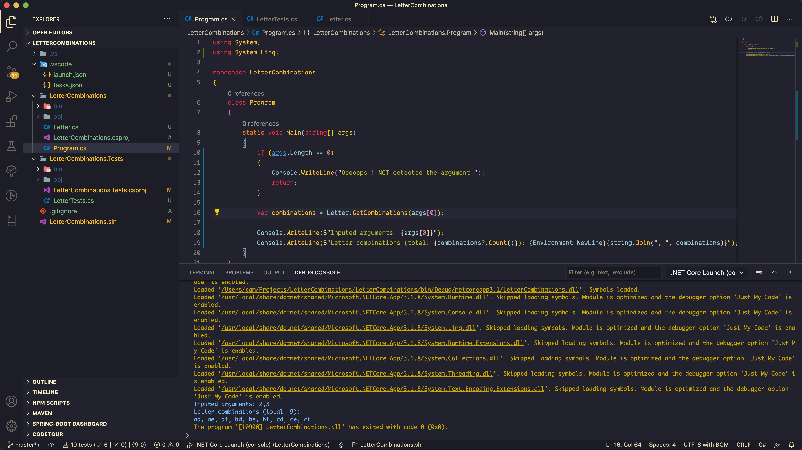
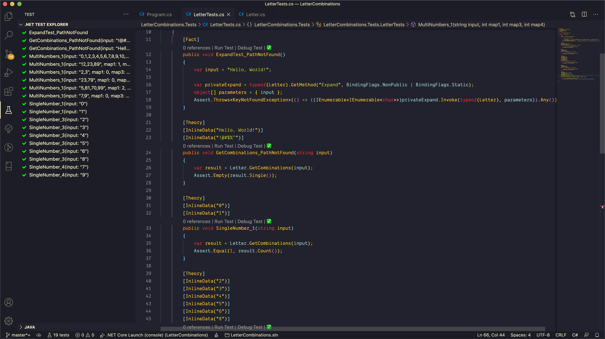

# Letter Combinations

Solutions for letter combination.

`combinations.count = 1^x * 3^y * 4^z`  
`numbers.count = x + y + z`  
`1: '0', '1'`  
`3: '2', '3', '4', '5', '6', '8'`  
`4: '7', '9'`

## Screen captures

Calling result  

Unit test  

